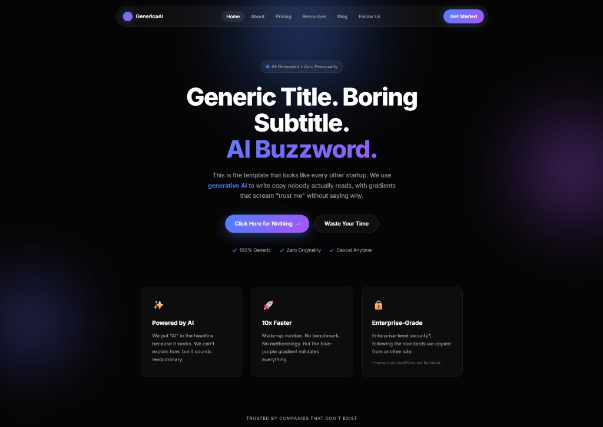
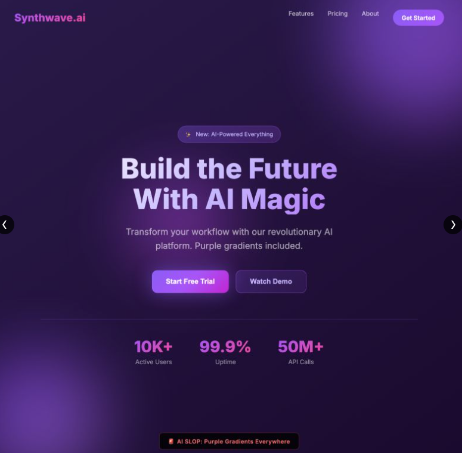
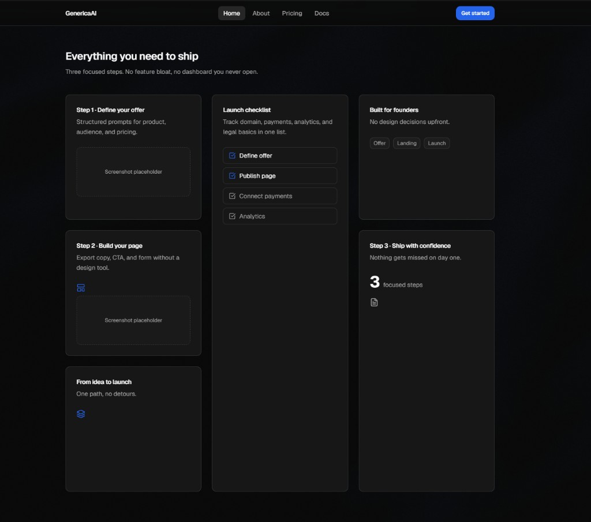

# Deslopify

> A Cursor Agent Skill that kills AI slop UI — and replaces it with something that actually looks like a real product.

[](LICENSE)

---

## The Problem

Every AI-generated interface looks like one of these:

<table>
<tr>
<td align="center" width="50%">

<br /><sub><b>GenericaAI</b> — emoji feature cards, fake social proof, purple/blue gradient, zero personality</sub>
</td>
<td align="center" width="50%">

<br /><sub><b>Synthwave.ai</b> — "Build the Future With AI Magic", purple gradients everywhere, made-up metrics</sub>
</td>
</tr>
</table>

The patterns are always the same: purple-to-indigo gradients, floating glow orbs, "revolutionary AI platform", fake user counts, emoji-titled feature cards. Interfaces that were **generated, not designed** — they signal nothing about your actual product and look identical to every other vibe-coded SaaS launched this week.

Deslopify fixes this. Not by stripping your UI down to bare HTML — but by replacing every slop pattern with a modern, intentional component that actually fits your brand.

**Golden rule: never remove without replacing something better.**

---

## What Good Looks Like

Not over-designed. Not stripped bare. Clean, structured, and with room for your own visual identity:

<table>
<tr>
<td align="center" width="50%">

<br /><sub><b>Features section</b> — bento grid with real content structure, screenshot placeholders, checklist items, no emoji noise, no gradient</sub>
</td>
<td align="center" width="50%">

<br /><sub><b>Hero section</b> — bold solid typography, direct copy, product UI in context, two-button CTA with clear hierarchy</sub>
</td>
</tr>
</table>

**What makes these work:**
- Dark solid background — no gradient, no orbs
- Typography does the heavy lifting: weight, size, and tracking create hierarchy without color tricks
- Functional elements visible in the hero (checklist, progress bar) — evidence the product exists
- Accent color (`#2563eb`) used once, on the primary CTA only
- Cards with borders and real content structure — no emoji icons, no vague titles
- Plenty of negative space — the layout breathes

This is the target quality. Deslopify's refactors aim here, calibrated to your specific brand and reference.

---

## How It Works

Deslopify follows a **grill-me style interview** before touching a single file. It asks one question at a time, always gives its own recommendation, and only starts executing once you've approved every decision.

The more context you give it — brand guidelines, a reference site, a template you like — the better the output. Passing a URL like `https://linear.app` or saying "I want it to feel like Stripe" is enough to completely calibrate all suggestions to your visual identity.

### Phase 0 — Mandatory Interview (5 questions, one at a time)

```
Deslopify: Do you have a defined visual identity for this product?
  Share anything: logo, color palette (hex/tokens), brand kit, main typeface.
  If you have nothing formal — no problem. We'll build from your reference.

→ You answer, e.g. "yes — accent #2563eb, font Inter"

Deslopify: Is there a website or product you want to use as a style reference?
  Examples:
    - A URL        → "https://linear.app"
    - A product    → "something like Stripe"
    - A template   → "https://21st.dev/r/author/template"
    - A screenshot → attach it
    - Free text    → "minimal dark for B2B SaaS"

  My recommendation: look at what your customers use every day.
  Selling to devs → Linear/Vercel. Selling to teams → Notion/Loom. Enterprise → Atlassian.

→ You answer, e.g. "Linear"

Deslopify: Accent color — based on Linear and your brand, I suggest keeping
  #2563eb or switching to #5e6ad2 (Linear's functional purple-blue). Which do you prefer?

→ You answer

Deslopify: Which sections or files do you want to refactor?
  My recommendation: hero + features + pricing — biggest visual impact immediately.

→ You answer

Deslopify: For each problem element I find, do you want to:
  a) Browse 21st.dev options yourself and choose
  b) I recommend one aligned to your reference, you confirm or reject
  c) Manual refactor — no new packages
  My recommendation: option B — faster, stays consistent with your identity, you still approve everything.

→ You answer → audit begins
```

### Phase 2 — Component-by-Component Questions

For every slop element found, one question. Never grouped:

```
Found: HeroSection.tsx — gradient purple/blue background + bg-clip-text heading
Issue: Decorative gradient (D-02) + AI purple/blue combo (D-03)
Profile: Linear style | accent #2563eb | Inter font

Replacement options:
  A) Hero Section by @moumensoliman  ⭐ RECOMMENDED
     Preview: https://21st.dev/r/moumensoliman/hero-section-shadcnui
     Install:  npx shadcn@latest add "https://21st.dev/r/moumensoliman/hero-section-shadcnui"
     Why: dark-first, bold tracking-tight typography, structured space for product screenshot — fits Linear

  B) Animated Hero by @ravikatiyar162
     Preview: https://21st.dev/r/ravikatiyar162/animated-hero-section-1
     Why: controlled animated CTA, no infinite loop, works with accent #2563eb

  C) Manual refactor in Linear style
     Removes gradient → solid bg-[#0f0f11], Inter bold tracking-tight headline,
     subtle dot-grid pattern, structured product screenshot area

My recommendation: A — direct alignment with Linear, minimal new code. Which do you prefer?
```

Execution only begins **after every question is answered and approved**.

---

## Why References and Templates Make It Dramatically Better

Without a reference, Deslopify applies generic flat design rules. The result is clean, but neutral.

With a reference, it:
- Pulls exact tokens from `IDENTITY-PROFILES.md` (background, surface, border, foreground, accent, font, radius, shadow)
- Filters 21st.dev suggestions by the reference's tone (dark-technical vs warm-editorial vs bold-minimal)
- Writes replacement code that matches the reference's specific conventions — not just "shadcn defaults"

**Recognized references (loaded automatically from `IDENTITY-PROFILES.md`):**

| Reference | Tone | Accent |
|---|---|---|
| Linear | Dark, technical, dense | `#5e6ad2` functional purple |
| Stripe | Corporate trust, polished | `#635bff` Stripe purple (solid only) |
| Vercel | Brutal clarity, typography-first | No accent — pure black/white contrast |
| Notion | Warm, editorial, humanized | `#2eaadc` used sparingly |
| Raycast | Dark premium, keyboard-first | `#ff6363` surgical coral |
| Loom | Friendly, visual, consumer | `#625DF5` rounded |
| Figma | Bold, editorial, creator-focused | Functional multicolor |

For any reference not listed, Deslopify will visit the URL and extract the tokens manually before proceeding.

---

## What Gets Fixed

| Category | Slop Detected | Replaced With |
|---|---|---|
| Design | Purple/blue gradients, glassmorphism, floating orbs | Flat surfaces + accent color + dot-grid texture |
| Design | `bg-clip-text` gradient text | Bold solid typography with tracking |
| Copy | "Powered by AI", "10x Faster", rocket emojis, "revolutionize" | Direct copy placeholders for real content |
| Copy | Fake testimonials (Alex Johnson, randomuser.me) | Structured component awaiting real data |
| UX | Spinners in content areas | Structural skeleton loaders matching real layout |
| UX | Icon-only buttons with no label | `title=""` + `<Tooltip>` |
| Engineering | Mutations without optimistic update | Optimistic state + rollback on error |
| Engineering | `useEffect + fetch` without cache | SWR / React Query with `staleTime` |

---

## Demo

Before/after examples live in [`demo/`](demo/):

| Version | Path | How to view |
|---------|------|-------------|
| **Before** (AI slop) | [`demo/ai-slop/`](demo/ai-slop/) | Open `index.html` in a browser |
| **After** (static) | [`demo/deslopped-static/`](demo/deslopped-static/) | Open `index.html` in a browser |
| **After** (React) | [`demo/deslopped/`](demo/deslopped/) | `npm install && npm run dev` |

See [demo/README.md](demo/README.md) for details.

## Installation

```bash
git clone https://github.com/AntonioSpagnol/UI-Deslopify-Skill ~/.cursor/skills/deslopify
```

Restart Cursor after cloning. The skill will be available across all your projects.

> **Language:** All skill files are in **English** for accessibility. The agent **responds in your language** — Portuguese or English — and audits copy in both (see Rule 9 in `SKILL.md`).

## Usage

```
@deslopify refactor the entire landing page
```

```
@deslopify I want to look like Linear — replace everything slop
```

```
@deslopify show me 21st.dev options for the hero section before changing anything
```

```
@deslopify engineering only: add optimistic rendering and API cache
```

```
@deslopify audit src/components/**/*.tsx and show me the report first
```

## Execution Pipeline

```
PHASE 0 — INTAKE        5 questions: brand identity, reference, accent, scope, replacement posture
PHASE 1 — AUDIT         Silent — reads files, maps elements, applies reference profile
PHASE 2 — QUESTIONNAIRE Per element: problem + 3 profile-aligned options + recommendation
PHASE 3 — EXECUTE       Installs chosen 21st.dev components + applies all approved decisions
PHASE 4 — UX POLISH     Skeleton loaders, icon-only button tooltips
PHASE 5 — ENGINEERING   Optimistic rendering, API cache strategy
PHASE 6 — VERIFY        Self-check against AUDIT-RULES.md + final report
```

## Reference Files

| File | Contents |
|---|---|
| `SKILL.md` | Skill entrypoint — pipeline, Phase 0 interview, all 15 rules, 21st.dev protocol |
| `IDENTITY-PROFILES.md` | Design tokens for popular references (Linear, Stripe, Vercel, Notion, Raycast…) |
| `AUDIT-RULES.md` | Complete violation catalog with before/after code examples |
| `PATTERNS.md` | Replacement snippets with visual character — skeletons, optimistic rendering, cache, flat design |
| `21ST-DEV-MAP.md` | Slop pattern → 21st.dev component mapping with default recommendation (⭐) per category |

## Update

```bash
cd ~/.cursor/skills/deslopify && git pull
```

## License

MIT — see [LICENSE](LICENSE).

## Contributing

Open issues or PRs at [github.com/AntonioSpagnol/UI-Deslopify-Skill](https://github.com/AntonioSpagnol/UI-Deslopify-Skill):
- New slop patterns → `AUDIT-RULES.md`
- Validated 21st.dev components → `21ST-DEV-MAP.md`
- Replacement snippets with visual character → `PATTERNS.md`
- New identity profiles → `IDENTITY-PROFILES.md`
