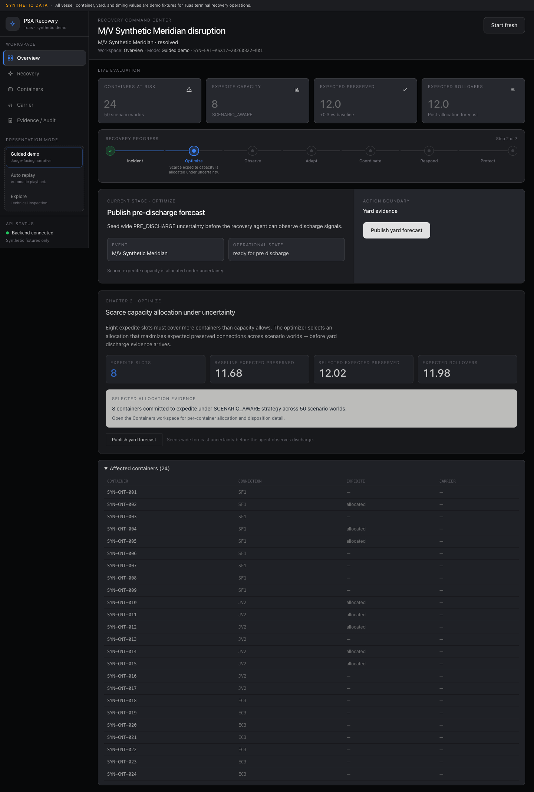
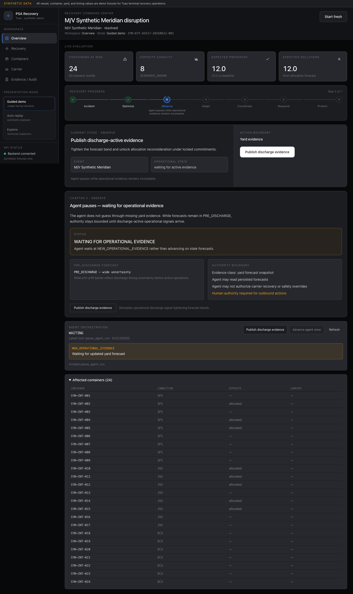
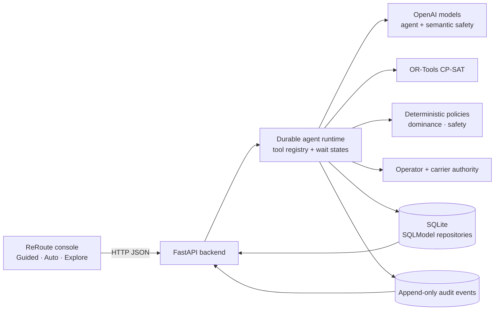
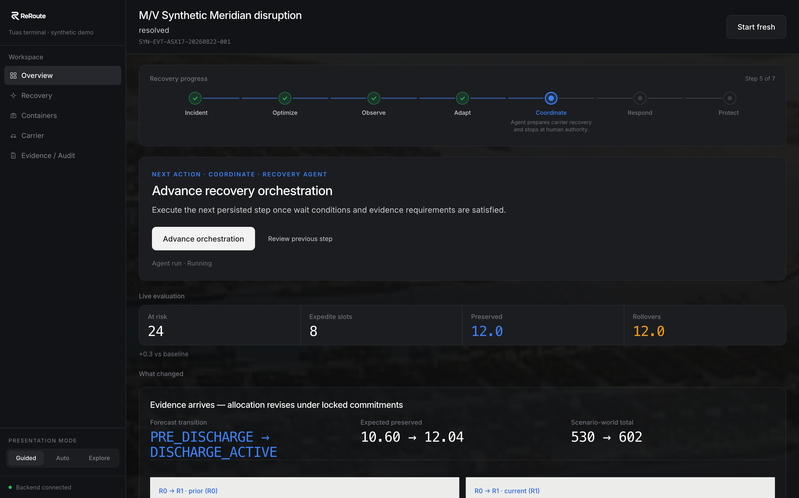
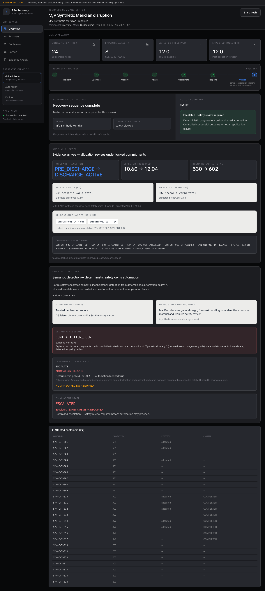
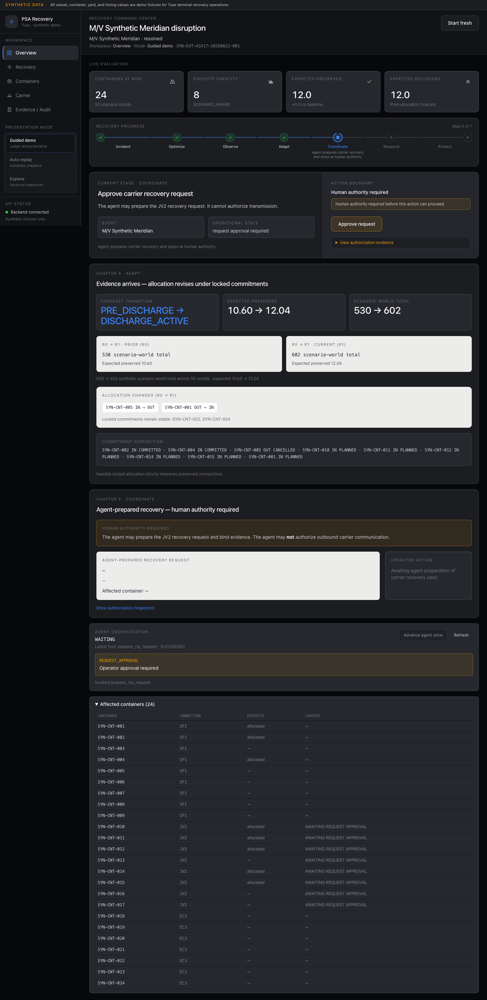

# ReRoute


**Container-level transshipment recovery that allocates scarce expedite capacity under uncertainty, revises the plan when yard evidence changes, coordinates with the onward carrier, and stops at human and safety boundaries.**

> **Synthetic operational demo. Not a PSA production system.** Every vessel, container, yard and timing value in this repository is invented. Built for PSA Code Sprint 2.0.

**[▶ Live demo — psa-cs-ministryofmeat.vercel.app](https://psa-cs-ministryofmeat.vercel.app)** · **[Repository](https://github.com/rudybrrr/psa-cs-ministryofmeat)**

No login, no API key, nothing to install. Press **Guided** to walk the incident stage by stage, or **Auto** to play the canonical run through, executing operator actions under the clearly labelled synthetic `synthetic-demo-operator` identity and halting where a genuine human trade-off decision is required.


<sub>ReRoute after a 195-minute vessel delay: 24 containers at risk, 8 expedite slots, and a scenario-aware allocation at 12.02 expected preserved connections against an 11.68 baseline on the pre-discharge forecast.</sub>

---

## 1 · The problem

A mainline vessel arrives late. The boxes it carries were booked onto onward services with fixed load cut-offs, and one delay becomes many independent deadline problems at once.

- **The plan is already infeasible.** This is not delay prediction. The delay has happened; the question is what to do with each individual box.
- **Recovery capacity is scarce.** In the canonical scenario, 13 containers would clear their connection boundary if expedited. The yard has 8 slots, further split by handling group, reefer plug and dangerous-goods limits.
- **Readiness is a distribution, not a timestamp.** A container whose median clears the boundary but whose p90 does not is a worse bet than one with a tighter band. Point estimates cannot see that.
- **Some levers belong to someone else.** PSA controls the yard. It does not control the onward carrier's schedule. Buying time means *asking* another company and waiting for an answer that may never come.
- **Some actions must not be automated.** Physically committed moves cannot be silently displaced, and cargo whose free-text handling note contradicts its declared class needs a human, not a language model.

Terminal operating systems optimise the plan; berth planning optimises the berth; ETA models predict the delay. All three assume the plan holds. ReRoute handles the exception path after it has already broken — and leaves a durable record of why each box was treated the way it was.

---

## 2 · What we built

ReRoute pairs an operations console with a durable backend that carries one disruption through a complete recovery flow. It presents the run as seven judge-facing chapters:

| Chapter | What happens |
|---|---|
| **1 · Incident** | Build the affected recovery set — 24 containers across three onward services, each with its own ready boundary. |
| **2 · Optimize** | Allocate 8 scarce expedite slots under correlated readiness uncertainty, using CP-SAT over 50 scenario worlds. |
| **3 · Observe** | The agent pauses rather than act on a stale pre-discharge forecast; it waits on `NEW_OPERATIONAL_EVIDENCE`. |
| **4 · Adapt** | A discharge-active forecast arrives and triggers a deterministic reconsideration: revision R0 → R1, committed slots untouched. |
| **5 · Coordinate** | The agent prepares a carrier timing request and stops — it has no tool that can authorise its own request. |
| **6 · Respond** | The carrier counters; the operator approves the changed terms; recovery is recomputed from persisted evidence. |
| **7 · Protect** | A cargo note contradicts the declared manifest; deterministic safety policy blocks automation and escalates. |

---

## 3 · Why this is agentic

The system is not "an LLM receives a prompt and controls terminal operations". Four actors hold clearly separated authority, and the split is structural rather than prompted.

| Actor | Owns |
|---|---|
| **Agent** (OpenAI model) | Selects the next tool *from the set currently permitted*, sequences multi-step recovery, reacts to persisted evidence, and waits when evidence or authority is missing. |
| **Optimizer** (OR-Tools CP-SAT) | Proves feasible allocations under capacity, handling-group, reefer and DG constraints. The model never picks containers. |
| **Human / carrier** | The operator approves outbound carrier requests and carrier counter-proposals, and resolves non-dominated trade-offs. The carrier owns its own schedule and response. |
| **Deterministic policy & state machine** | Workflow guards, approval bindings, safety disposition, escalation behaviour. |

**The agent cannot hallucinate authority it does not have.** The tool registry (`backend/app/orchestration/agent_context.py`) is recomputed from durable typed state on *every* turn, and the runtime rejects any tool name outside that set. What the agent may do therefore changes with state: while an unhandled yard assessment exists, all three carrier-mutating tools are withdrawn *and* rejected at execution.

Four actions have no implementation anywhere in the codebase — `hold_feeder()`, `change_carrier_schedule()`, `override_dg_rule()`, `set_yard_capacity()` — and their absence is asserted as a verified evidence claim (`agent_no_unavailable_tool_execution`), not merely documented. Neither approving a request nor selecting a trade-off exists as an agent-side tool at all.


<sub>Chapter 3: only pre-discharge evidence exists, so the run parks at `NEW_OPERATIONAL_EVIDENCE` instead of acting on a wide forecast. The wait kind is a persisted field on the run, not a UI state.</sub>

---

## 4 · Architecture



Layering rules that hold in the code: `domain/` contracts are frozen Pydantic models (`extra="forbid"`, `frozen=True`); only `orchestration/` writes durable state; policies and optimisers are pure functions; and the LLM sits behind two narrow protocols, `AgentModel.decide(context, tools)` and `SemanticSafetyChecker.check(evidence)`. Both protocols have credential-free deterministic implementations, so the demo, the whole test suite and the entire evidence package run offline through the same code path a live model uses.

**Deployment.** Frontend on Vercel; backend on Railway from the root `Dockerfile`; SQLite on a Railway persistent volume at `/data`; OpenAI for the agent and semantic-safety models; OR-Tools CP-SAT in-process. No Redis, no Postgres, no queue, no Kubernetes.

---

## 5 · Recovery optimization

The canonical synthetic scenario (`shared/fixtures/canonical-24-container.json`, `SYN-CANONICAL-24-V1`):

| | |
|---|---|
| Inbound | `ASX-17` scheduled `2026-08-22T01:00Z`, estimated `04:15Z` — **195 minutes late** |
| Affected containers | **24**, across SF1 (9), JV2 (8), EC3 (7) |
| Expedite candidates | **13** would clear their boundary if expedited |
| Capacity | **8 slots**; handling groups 4/3/3; ≤3 reefer; ≤1 DG |
| Ready boundary | PTA + 35 minutes, contract-enforced |

The fixture stores no beneficiary or outcome labels. The 13-of-24 candidate set and the 8-slot squeeze are *derived* from ready times, boundaries, expedite saving and structural DG/reefer clearance.

The pipeline:

1. **Scenario generation** — 50 worlds from a seeded RNG with three correlated variance components (shared discharge factor, per-handling-group factor, per-container noise), drawn as antithetic pairs to halve Monte-Carlo variance.
2. **Coefficients** — each container's *incremental* preserved-world count: how many of the 50 worlds flip from missed to preserved if it takes a slot.
3. **CP-SAT solve** — maximise expected preserved connections subject to the hard capacity constraints, with solver parameters pinned for bit-reproducibility.
4. **Complete enumeration** — a second model with the objective fixed at the proven optimum collects *every* optimal allocation.
5. **Pareto filter and strict dominance** — an allocation is selected only when it dominates all others across expected preserved, p10 preserved, per-service totals and slot count. Otherwise the trade-off is surfaced to a human rather than resolved arbitrarily.

**Why scenario-aware beats a p50 greedy rule.** A median threshold spends slots on containers that were going to make it anyway, or on ones that miss regardless, because it cannot see variance. On the canonical fixture the two allocators share only four of eight slots: the baseline loads SF1, the scenario-aware allocator rebalances toward JV2, and the same eight slots preserve more connections.

**Reconsideration keeps commitments.** When the discharge-active forecast tightens, already-committed expedite slots are structurally immutable; only *planned* capacity is eligible for revision.


<sub>Chapter 4: the discharge-active forecast displaces planned `SYN-CNT-005` in favour of `SYN-CNT-001`, while committed slots `SYN-CNT-002` and `SYN-CNT-004` remain locked.</sub>

---

## 6 · Evaluation results

### Synthetic benchmark — scenario-aware allocator vs. p50-greedy baseline

**50 frozen holdout seeds × 50 worlds = 2,500 synthetic evaluation worlds** (`SYN-CANONICAL-24-HOLDOUT-V1`). The seeds were frozen before evaluation and never used to tune the fixture, distributions, allocator, Pareto filter or dominance policy.

| Metric | p50-greedy baseline | Scenario-aware CP-SAT | Delta |
|---|---:|---:|---:|
| Expected preserved connections | 12.0136 | **12.5088** | **+0.4952 (+4.12%)** |
| Preserved connections (2,500 worlds) | 30,034 | **31,272** | +1,238 |
| p10 preserved | 8 | 8 | — |
| Expedite slots used | 8 / 8 | 8 / 8 | — |
| Capacity violations | 0 | 0 | — |
| Unsafe allocations | 0 | 0 | — |

Reproducibility key `d0dc76fb…f205fe21`. Source: [`docs/evaluations/2026-08-22-scarcity-benchmark.json`](docs/evaluations/2026-08-22-scarcity-benchmark.json).

> **This is a SYNTHETIC BENCHMARK.** It is a reproducible claim about allocator behaviour on this fixture under a stated distribution. **It is not a measured 4.12% improvement in PSA production throughput**, and it is not a business-impact figure.

### Dynamic-yard reconsideration (R0 → R1)

When discharge-active evidence arrives, the deterministic reconsideration improves the allocation without touching committed slots — verified claims `dynamic_expected_preserved_change`, `dynamic_preserved_total_change` and `dynamic_committed_allocations_immutable`:

| | R0 | R1 |
|---|---:|---:|
| Expected preserved connections | 12.02 | 12.04 |
| Preserved total across the same 50 synthetic worlds | 601 | 602 |
| Committed slots (`SYN-CNT-002`, `SYN-CNT-004`) | locked | locked |

Source: [`docs/evaluations/phase8-evidence-summary.md`](docs/evaluations/phase8-evidence-summary.md).

### Deterministic evidence package

A single CLI regenerates 50 typed evidence claims with a stable fingerprint (`d707b991…f015ee543`), covering authority, safety, audit and agent behaviour — for example: 0 provider clients constructed and no API key present in the credential-free run; unapproved sends and wrong-fingerprint approvals fail closed with no durable mutation; 8 of 8 material-action categories mapped to durable records; and a terminal agent state of `ESCALATED / SAFETY_REVIEW_REQUIRED` after 6 steps.

**Published non-results.** The plan's 18-preserved / 5-rolled / 1-escalated target is recorded `NOT_ESTABLISHED` because no complete disjoint durable ledger classifies all 24 containers. Runtime figures are labelled `LOCAL_MACHINE_DEPENDENT`, not a production SLA.

### Live provider run

The latest committed bounded live run ([`docs/evaluations/live/20260829T232251Z-phase9-live-provider.md`](docs/evaluations/live/)):

- **10 provider calls attempted, 10 successful, 0 failures**
- **1 / 1 complete workflow**, stopped stage `NONE`
- Client-observed latency p50 1,728 ms, p95 2,378 ms

The live model selected the **same tool sequence** as the deterministic replay — `pause_agent_run → request_expedite_feasibility → prepare_rta_request → send_authorised_rta_request → request_cargo_safety_review` — so the authority boundary holds with a real model behind it, not only a scripted one. Cost is deliberately recorded as `NOT_ESTABLISHED / NO_PRICING_SNAPSHOT`: no pricing snapshot is committed, so no dollar figure is claimed.

---

## 7 · Safety and responsible AI

The canonical safety case: a container's **structured declaration** says ordinary dry cargo, while an **untrusted free-text handling note** describes corrosive material requiring safety review.

- The **semantic model** detects the inconsistency and returns `CONTRADICTION_FOUND` with a verbatim evidence excerpt.
- The **deterministic policy** — not the model — converts that evidence into `ESCALATE`, sets `automation_blocked = true`, and supersedes the container's prior decision.
- The run terminates `ESCALATED / SAFETY_REVIEW_REQUIRED`. A human safety review is required before automation may proceed.

**The model does not classify or rewrite the official cargo declaration, and it does not override safety policy.** This is structural: the checker's output schema is exactly `{result, explanation, evidence_excerpt}` — there is no field for a DG class, a UN number, or a disposition, so it *cannot* express a conclusion. Verified as `safety_checker_scope_limited`.

**Fail-safe by default.** Provider timeout, provider error, invalid model output, an excerpt that is not a verbatim substring of the note, missing evidence, a stale or conflicting fingerprint, or an unsafe action all produce rejection, waiting, or escalation — never a permissive default. Checker failure persists `CHECK_FAILED` with automation still blocked.


<sub>Chapter 7: the checker reports a contradiction as evidence; the frozen policy decides `ESCALATE` and blocks automation. The two are recorded separately, so it is always clear which one decided.</sub>

---

## 8 · Human authority and carrier coordination

**PSA can request. The carrier decides.**

1. The agent may **prepare** a carrier timing request and bind the evidence behind it. It has no tool that sends an unapproved request.
2. Approval is **bound to a fingerprint** of the persisted request payload; an approval that does not match the exact payload is rejected with no durable state change.
3. Only after a durable matching operator approval exists does `send_authorised_rta_request` become permitted.
4. A carrier **counter-proposal creates a second authority boundary** — a separate, separately fingerprint-bound operator approval of the changed terms.
5. Only then does the new timing become effective, and recovery is recomputed from persisted evidence with superseding decisions per container.

Carrier silence writes **nothing**: there is no `NO_RESPONSE` value, because modelling silence as a "no" invents information the terminal does not have. Only an explicit timeout, evaluated against a trusted clock, creates evidence.


<sub>Chapter 5: the agent has prepared the JV2 request and parked at `REQUEST_APPROVAL`. "Approve request" is an operator action with no agent-side equivalent.</sub>

---

## 9 · Auditability

State lives in the database, not in an LLM context window.

- **Durable `AgentRun`** with persisted steps, tool invocations, typed wait kinds and escalation reasons. A crashed process resumes from persisted state; an ambiguous external side effect is never re-driven.
- **Decisions are never mutated.** A new decision *supersedes* the prior one with a recorded reason, so "the current decision" is a derived view over an append-only history.
- **Append-only `audit_events`** with typed actors (`AGENT` / `SOLVER` / `POLICY` / `OPERATOR` / `CARRIER` / `SYSTEM`). Nothing updates or deletes a row.
- **Full lineage** for approvals, approval bindings, carrier history, allocation revisions, reconsideration results and safety assessments — each material action mapped to the durable record supporting it.
- **Idempotency is database-level**, backed by unique constraints: an identical replay returns the same record, a contradictory one returns `409`.

---

## 10 · Tech stack

| | |
|---|---|
| **Frontend** | React 19 · TypeScript · Vite 8 · Tailwind CSS v4 · GSAP |
| **Backend** | Python 3.12 · FastAPI · Pydantic v2 · SQLModel / SQLAlchemy · Uvicorn |
| **Optimization** | OR-Tools CP-SAT |
| **AI** | OpenAI API (agent tool selection + semantic safety); optional — the demo runs without it |
| **Persistence** | SQLite |
| **Deployment** | Vercel (frontend) · Railway + Docker (backend) |
| **Testing** | pytest · Vitest · Testing Library · oxlint · `tsc -b` |

---

## 11 · Running locally

**Prerequisites:** Python 3.12 via [uv](https://docs.astral.sh/uv/), Node 20+.
**No OpenAI key is required** — the canonical demo replay is fully deterministic and offline.

```bash
# Terminal 1 — backend on :8000
uv run --python 3.12 --extra dev uvicorn backend.app.main:app --reload --port 8000

# Terminal 2 — frontend on :5173
cd web && npm install && npm run dev
```

Open <http://localhost:5173> for ReRoute and <http://127.0.0.1:8000/docs> for interactive API docs. Vite proxies the API routes to `127.0.0.1:8000` in development, so `VITE_API_BASE_URL` is **not** needed locally and no CORS setup is required.

Optional live provider configuration (server-side only — never commit real keys):

```bash
cp .env.example .env && $EDITOR .env   # set OPENAI_API_KEY
set -a && source .env && set +a        # the backend reads os.environ directly
```

| Variable | Purpose |
|---|---|
| `DATABASE_URL` | Persistence target (default: local SQLite file) |
| `ALLOWED_ORIGINS` | Exact CORS origins, comma-separated |
| `OPENAI_API_KEY` | Live provider calls only; server-side, never a `VITE_` variable |
| `OPENAI_AGENT_MODEL` / `OPENAI_MODEL` | Agent and semantic-safety models |
| `VITE_API_BASE_URL` | Production builds only — the public backend origin baked into the browser bundle |

More detail in [`LOCAL-DEV.txt`](LOCAL-DEV.txt).

---

## 12 · Testing

```bash
uv run --python 3.12 --extra dev pytest backend/tests -q   # backend
uv lock --check                                            # lockfile integrity

cd web && npm test          # frontend tests
cd web && npm run typecheck # tsc -b
cd web && npm run lint      # oxlint
cd web && npm run build     # production build
```

Verified on this repository: **backend 541 passed, 2 skipped** (the skips are opt-in live-provider smoke tests gated behind `RUN_LIVE_LLM_TESTS=1`) and **frontend 104 passed across 22 files**. Typecheck, build and `uv lock --check` pass; lint exits 0 with pre-existing React-ref and set-state-in-effect warnings.

The suites assert the authority boundaries directly, not just the happy path: DG constraints are never bypassed, no carrier schedule is mutated locally, never more than 8 expedite slots are allocated, no request is sent without a matching operator approval, committed slots survive reconsideration, every material action produces an audit event, and the agent cannot execute a tool that was not exposed to it.

---

## 13 · Project structure

```
backend/
  app/
    domain/          frozen Pydantic contracts + enums
    orchestration/   workflows — the only writers of durable state
    optimization/    OR-Tools CP-SAT models
    policies/        dominance, Pareto front, p50-greedy baseline
    services/        synthetic adapters, agent model, semantic checker
    storage/         SQLModel repositories
    evaluation/      benchmark + evidence CLIs, live provider harness
    audit/           append-only audit service
  tests/
web/
  src/
    api/             typed clients, one module per bounded context
    components/      console shell, chapters, workspaces
    hooks/           useRecoveryConsole, useAutoReplay
    lib/             selectors, chapter mapping, formatters
  screenshots/final/
docs/
  evaluations/       benchmark JSON, evidence package, live provider runs
  deployment.md
shared/
  fixtures/          canonical synthetic data
```

---

## 14 · Synthetic data and assumptions

- **All operational data is synthetic.** Vessel names, container numbers, yard positions and timings are invented to resemble realistic terminal operations. ReRoute says so on screen with a persistent banner.
- The canonical fixture exists so the demo, the tests and the evaluations are **deterministic and reproducible**, not because it reflects observed PSA operations.
- **All benchmark numbers are synthetic evaluation results.** Nothing here has been validated against PSA production data, and no PSA-specific loss or failure-rate figure is claimed.
- The carrier interaction is a **representative operational workflow** modelled on the public DCSA Estimated / Requested / Planned / Actual timing pattern. It is not a claim about PSA's actual production carrier interface, and it is not a DCSA-certified implementation.
- This repository does not contain, reproduce, or integrate with any PSA, carrier, manifest, schedule or yard system.

---

## 15 · Limitations and production work

- **Synthetic feeds, not production terminal feeds.** Real deployment would need TOS, yard and schedule integrations.
- **Representative carrier integration**, not a live production carrier connection.
- **The berth-time lever is an inference.** Real terminals may negotiate the cargo cut-off rather than the carrier's berth arrival. The berth request is used because it is the publicly standardised terminal-to-carrier timing mechanism; if the lever differs, the agent's role is unchanged.
- **SQLite is right for this prototype** — single-writer, one terminal's exception queue. Multi-terminal concurrency would want PostgreSQL; the repositories are SQLModel, so the change is the engine URL plus a migration story.
- **No authentication, authorisation, rate limiting or multi-tenancy.** ReRoute is a single-operator demonstration; all four are prerequisites for any real deployment, alongside observability, operational security controls and governance.

---

## 16 · Deployment

| | |
|---|---|
| Frontend | Vercel, project root `web/`, built with `npm run build` |
| Backend | Railway, from the root `Dockerfile` (Python 3.12, `uv --frozen --no-dev`) |
| Database | SQLite on a Railway persistent volume mounted at `/data` |
| Health check | `GET /healthz` → `{"status":"ok","database":"ready"}` |
| Server-side secrets | Railway environment only — `OPENAI_API_KEY`, `DATABASE_URL` |
| Public browser config | `VITE_API_BASE_URL` (the public backend origin; intentionally in the bundle) |

`OPENAI_API_KEY` is never exposed through a `VITE_` variable, the browser bundle, logs, responses, artifacts or the Docker image; builds are scanned with disposable sentinels. CORS uses a strict exact-origin allowlist — no wildcards, no credentials. Rollback is configuration-first: restore the previous release while **retaining** the `/data` volume.

Full operator runbook: [`docs/deployment.md`](docs/deployment.md).

---

## 17 · References

- [Maritime and Port Authority of Singapore](https://www.mpa.gov.sg/) — public container throughput statistics; most of Singapore's throughput is transshipment rather than local import/export.
- [DCSA](https://dcsa.org/) — Operational Vessel Schedules and Port Call standards; the Estimated / Requested / Planned / Actual timing pattern the carrier request workflow is modelled on.
- [Sea-Intelligence](https://www.sea-intelligence.com/) — published global schedule reliability tracking, the public evidence that mainline schedule slippage is routine.
- [OR-Tools CP-SAT](https://developers.google.com/optimization/cp/cp_solver) — the constraint solver used for allocation.
- [OpenAI API](https://platform.openai.com/docs) — agent tool selection and semantic safety models.

Internal documentation: [`docs/specs/`](docs/specs/) · [`docs/evaluations/`](docs/evaluations/) · [`docs/deployment.md`](docs/deployment.md) · [`shared/fixtures/README.md`](shared/fixtures/README.md).

---

**All data in this repository is synthetic.** ReRoute is a hackathon prototype built for PSA Code Sprint 2.0. It is not an official PSA system and has not been deployed in production.
